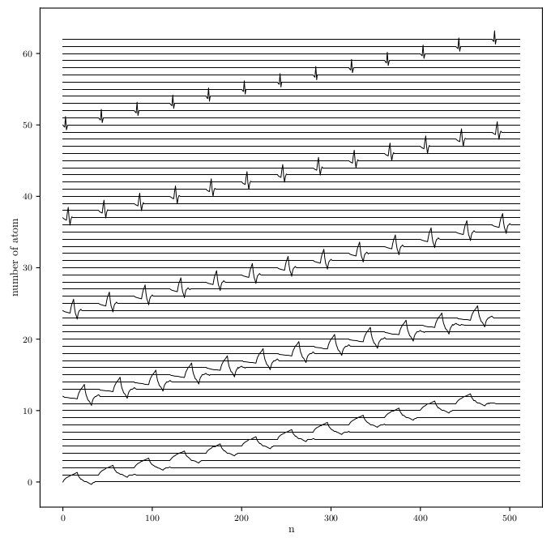

# spdict (Sparse Dictionary Builder)
This package is a simple sparse dictionary builder. The basic idea is pass your atoms to `create_sparse_dict_from_atoms` function to return your custom sparse dictionary. 

The package use PyWavelets (https://pywavelets.readthedocs.io) to build standar dictionaries like Stationary Wavelet Transform (SWT), Wavelet Packet Decomposition (WP) and Contiguous Wavelet Transform (CWT).


## Installation

```
pip install git+https://github.com/sfcaracciolo/spdict.git
```

## Usage

```python
import spdict 

atoms = spdict.get_swt_atoms('db2', 4) # get 4 detail levels of db2 and the scale atom (5 atoms in total)
D = spdict.create_sparse_dict_from_atoms(
    atoms, # list of atoms to slide
    n = 1024, # size of window
    steps = 40 # slide in samples
)
```

